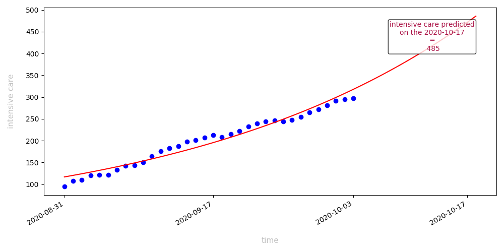
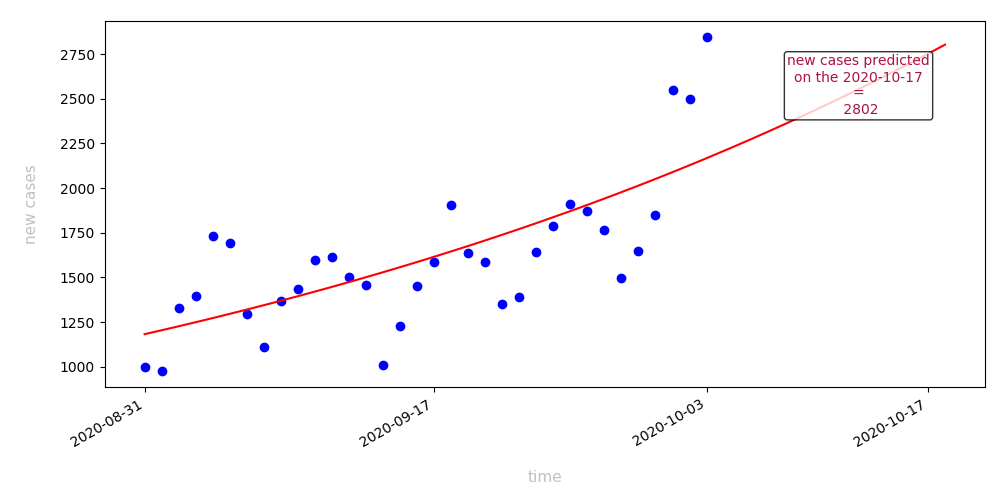
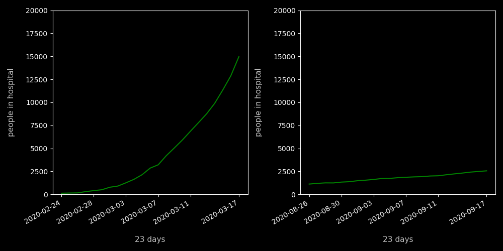
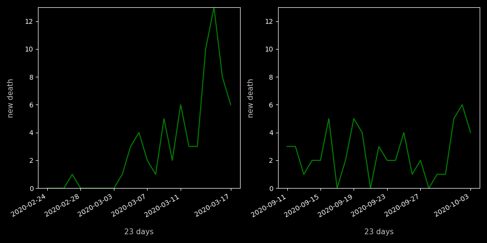
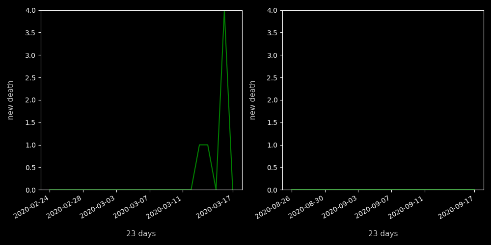
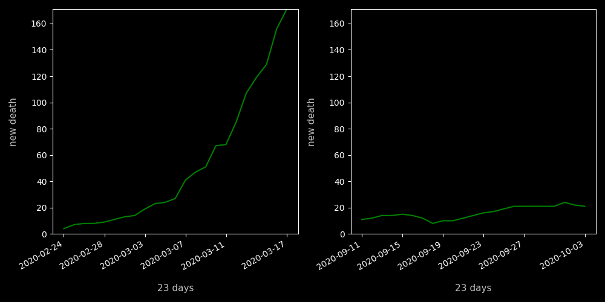
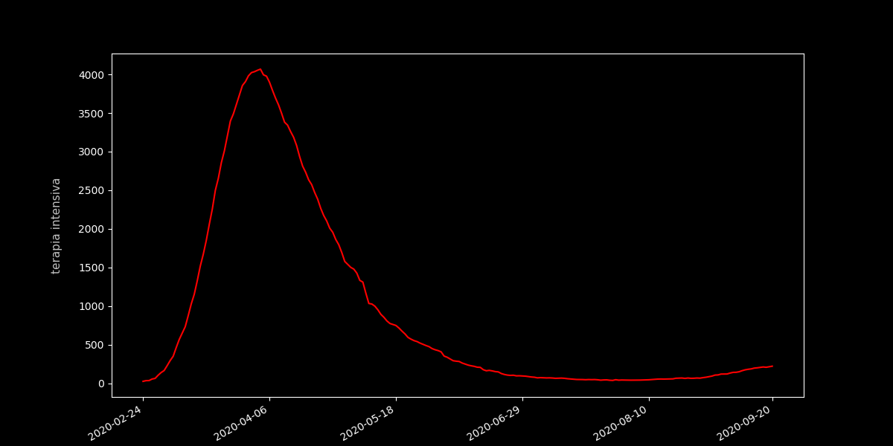
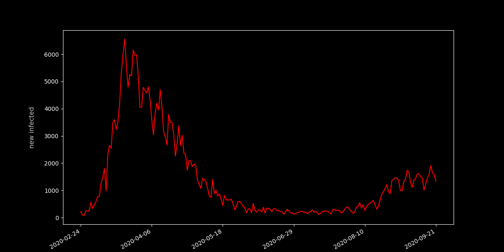

# COVID-autumn-forecast

HI, this readme is autogenerated when main.py is run.
latest update --> 2020-09-15

The data used in the forecasts is available at [pcm-dpc covid repository](https://github.com/pcm-dpc/COVID-19/blob/master/dati-json/dpc-covid19-ita-regioni.json)

## Risultati

#### Previsioni

Previsione a 2 settimane nel futuro del numero di casi in **terapia intensiva**. (modello `Yapprossimata=Ae^(Bx)`)

Previsione a 2 settimane nel futuro del numero di nuovi casi. (modello `Yapprossimata=Ae^(Bx)`)

#### Aprile vs Settembre

Persone in ospedale causa covid: aprile e settembre

Morti in **Veneto** causa covid: aprile e settembre

Morti in **Trentino** causa covid: aprile e settembre

Terapia Intensiva in **Veneto** causa covid: aprile e settembre

Terapia Intensiva in **Lazio** causa covid: aprile e settembre

#### Storici

Storico dei ricoverati in terapia intensiva

Storico dei nuovi casi registrati

    