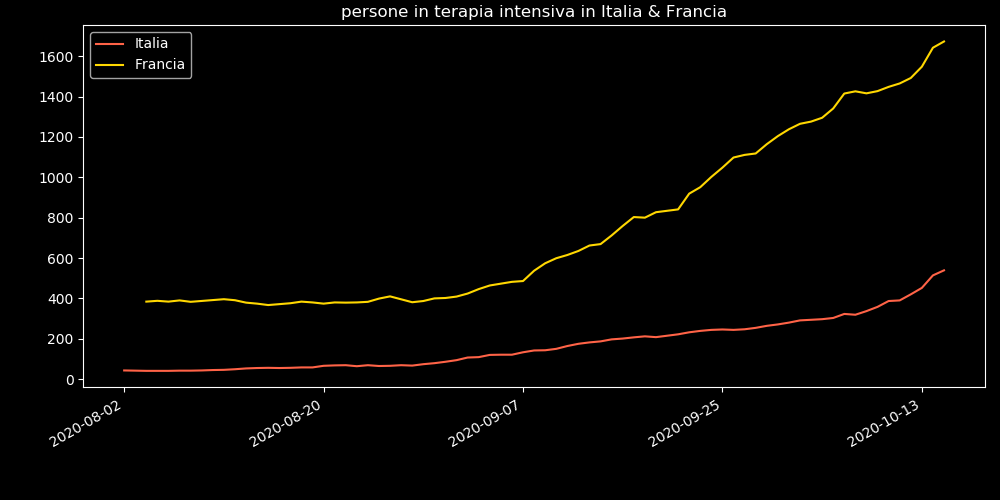
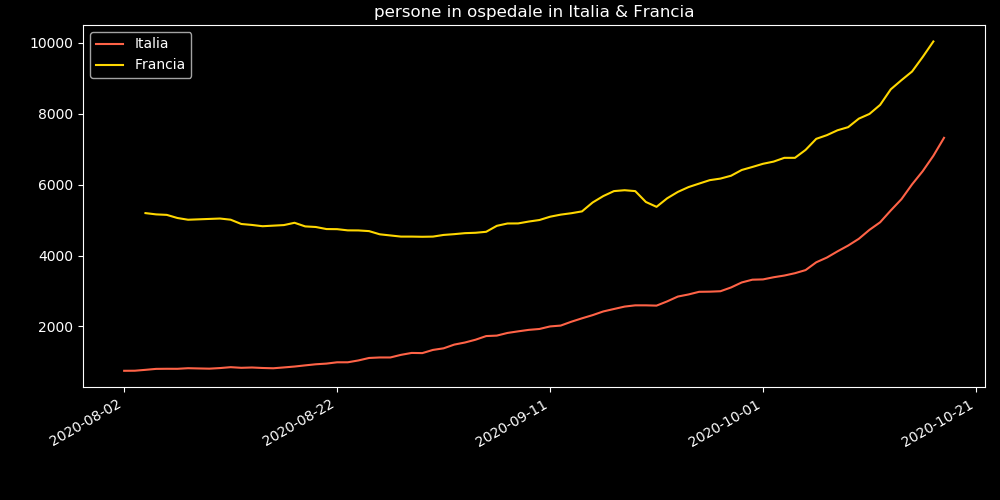
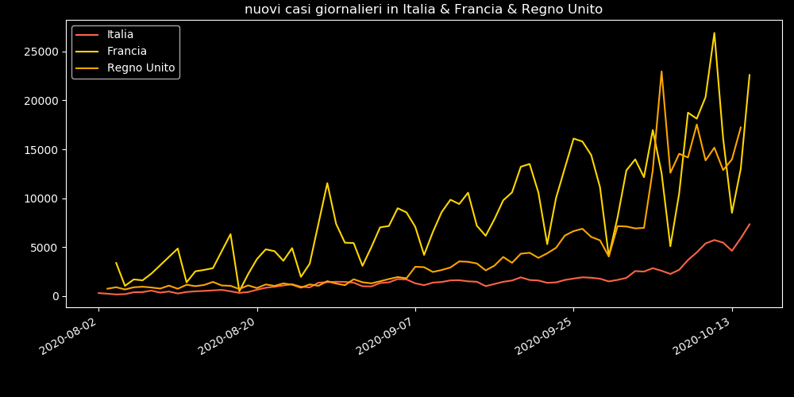
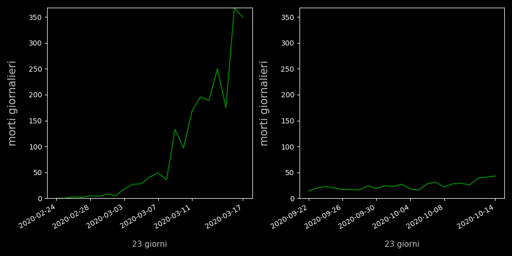
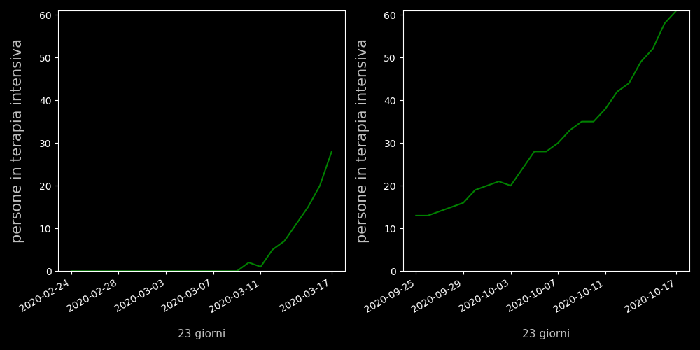

# COVID-autumn-forecast
Alcune Statistiche sul covid in Italia, Francia & Inghilterra
ultimo aggiornamento --> 2020-10-23
Fonte dei dati sull' italia: [pcm-dpc covid repository](https://github.com/pcm-dpc/COVID-19/blob/master/dati-json/dpc-covid19-ita-regioni.json)
Altre fonti: [Francia]('https://raw.githubusercontent.com/opencovid19-fr/data/master/dist/chiffres-cles.json'),  [Regno Unito](https://api.coronavirus.data.gov.uk/v1)

## Dati Generali
```
L'Italia il 15 marzo 2020
    terapia_intensiva:      1672
    nuovi_positivi:         3590
    totale_ospedalizzati:   11335 
```
```
L'Italia il 18 marzo 2020
    terapia_intensiva:      2257
    nuovi_positivi:         4207
    totale_ospedalizzati:   16620 
```
```
L'Italia 3 giorni fa
    terapia_intensiva:      539
    nuovi_positivi:         7332
    totale_ospedalizzati:   6009
```
```
L'Italia OGGI
    terapia_intensiva:      705
    nuovi_positivi:         10925
    totale_ospedalizzati:   7322
```


### Confronto tra nazioni europee

Italia_Francia_intensive.png

Italia_Francia_hospitalized.png

Italia_Francia_RegnoUnito_new_cases.png


### Predizioni per le prossime 2 settimane

national_intensive.png


### Storici (andamento da aprile 2020)

national_intensive.png


### Confronto tra i giorni precedenti al lockdown e oggi

national_deaths.png

Veneto_intensive.png

Sicilia_intensive.png

P.A.Trento_intensive.png

Lombardia_intensive.png
