# COVID-autumn-forecast
Alcune Statistiche sul covid in Italia, Francia & Inghilterra
ultimo aggiornamento --> 2021-02-20
Fonte dei dati sull' italia: [pcm-dpc covid repository](https://github.com/pcm-dpc/COVID-19/blob/master/dati-json/dpc-covid19-ita-regioni.json)
Altre fonti: [Francia]('https://raw.githubusercontent.com/opencovid19-fr/data/master/dist/chiffres-cles.json'),  [Regno Unito](https://api.coronavirus.data.gov.uk/v1)

## Dati Generali
```
L'Italia il 15 marzo 2020
    terapia_intensiva:      1672
    nuovi_positivi:         3590
    totale_ospedalizzati:   11335 
```
```
L'Italia il 18 marzo 2020
    terapia_intensiva:      2257
    nuovi_positivi:         4207
    totale_ospedalizzati:   16620 
```
```
L'Italia 3 giorni prima
    terapia_intensiva:      2043
    nuovi_positivi:         12074
    totale_ospedalizzati:   20317
```
```
L'Italia pochi giorni fa (2021-02-20)
    terapia_intensiva:      2063
    nuovi_positivi:         14931
    totale_ospedalizzati:   19788
```

___
La pandemia del 1918 era stagionale, come questa


### Confronto tra nazioni europee


Confronto tra nazioni europee dei casi di TERAPIA INTENSIVA in Italia-Francia
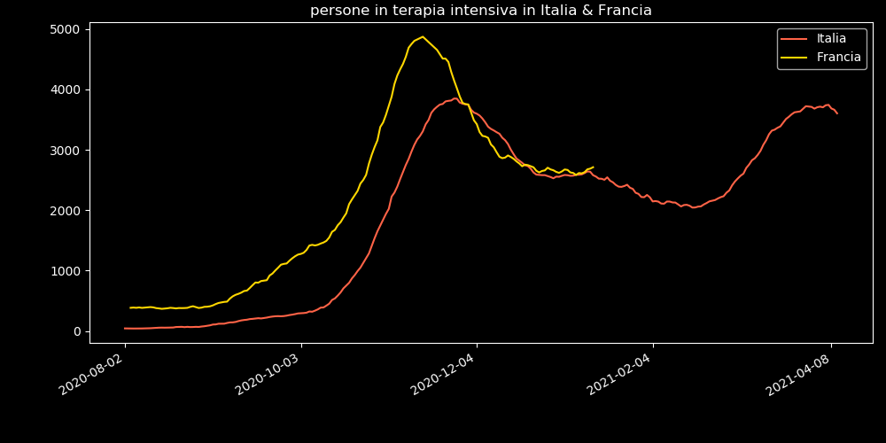

Confronto tra nazioni europee del numero di persone attualmente in ospedale causa COVID-19 in Italia-Francia
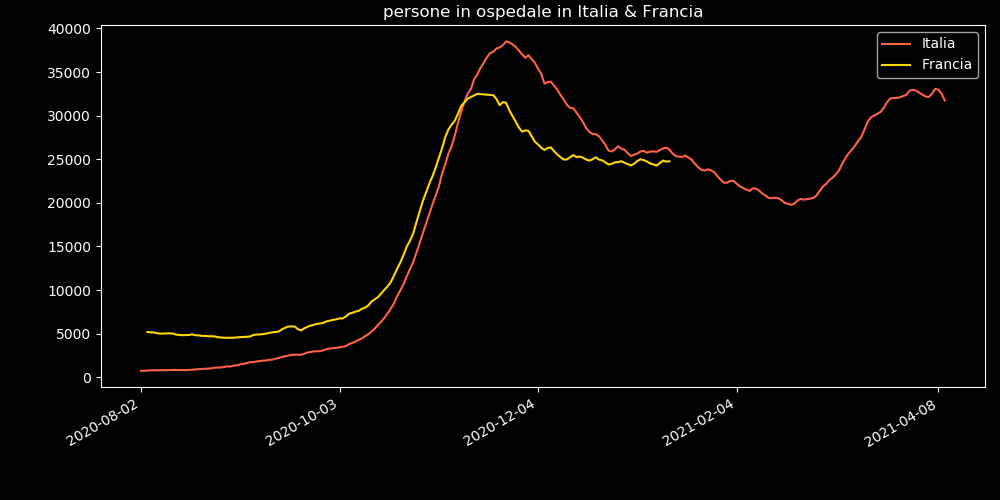

Confronto tra nazioni europee dei nuovi casi positivi al tampone in Italia-Francia-RegnoUnito
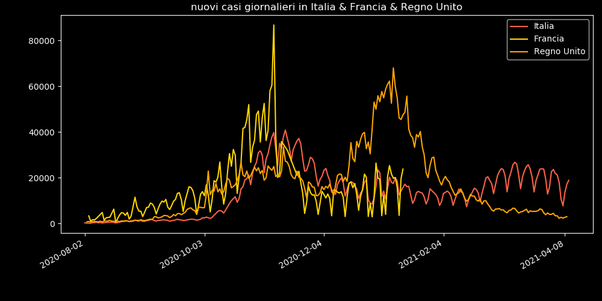

### Predizioni per le prossime 2 settimane


Predizioni per le prossime 2 settimane dei casi di TERAPIA INTENSIVA in Italia
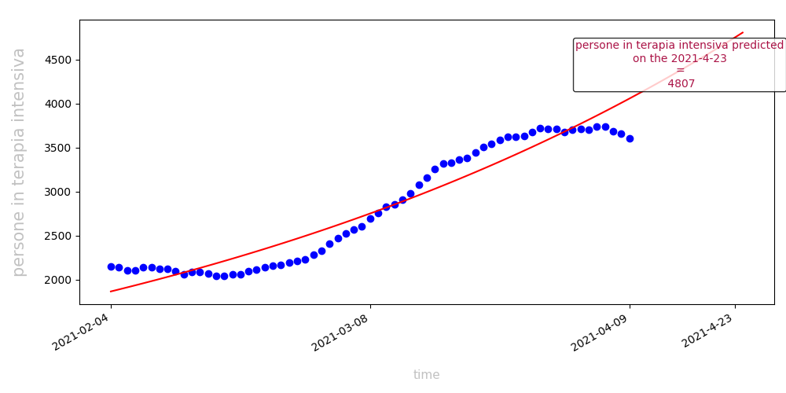

Predizioni per le prossime 2 settimane del numero di persone attualmente in ospedale causa COVID-19 in Italia
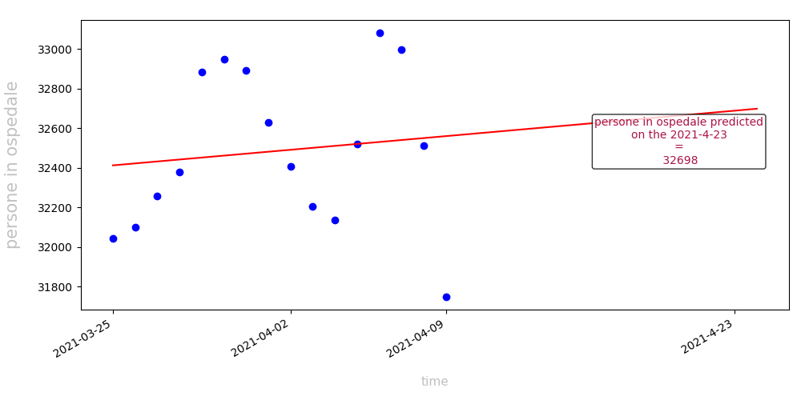

### Storici (andamento da febbraio 2020)


Storici (andamento da febbraio 2020) dei nuovi casi positivi al tampone in Italia


Storici (andamento da febbraio 2020) dei casi di TERAPIA INTENSIVA in Italia
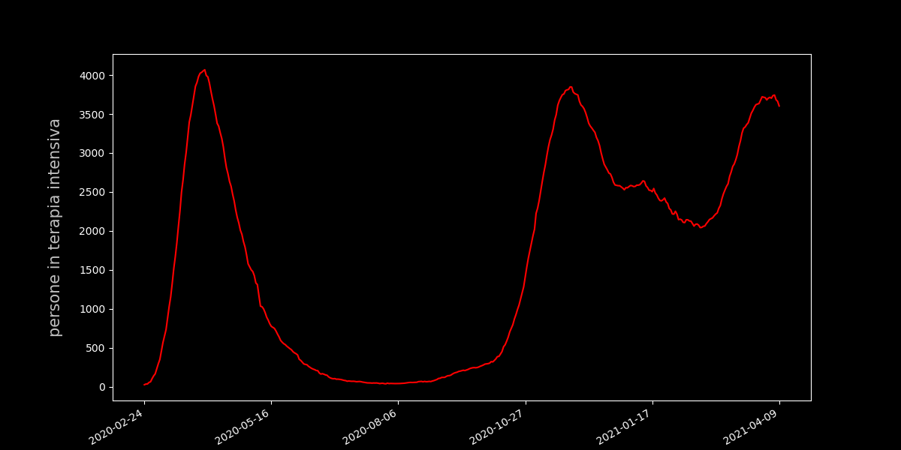

Storici (andamento da febbraio 2020) del numero di persone attualmente in ospedale causa COVID-19 in Italia


Storici (andamento da febbraio 2020) delle morti causate da COVID-19 in Italia
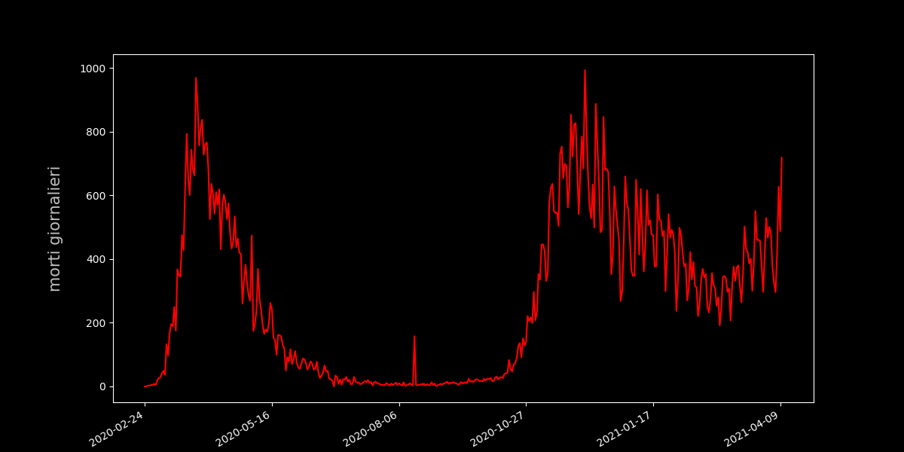

### Confronto tra i giorni precedenti al lockdown e oggi


Confronto tra i giorni precedenti al lockdown e oggi dei nuovi casi positivi al tampone in Veneto
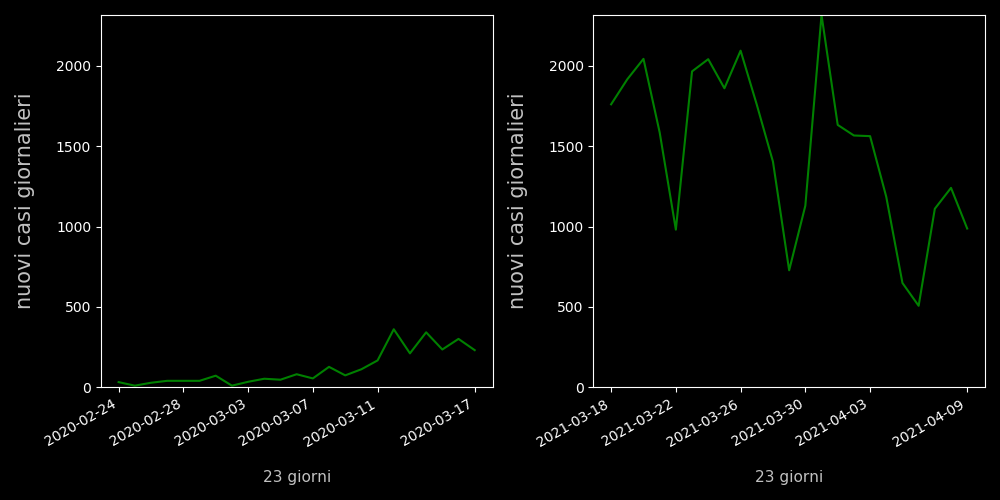

Confronto tra i giorni precedenti al lockdown e oggi dei casi di TERAPIA INTENSIVA in Veneto
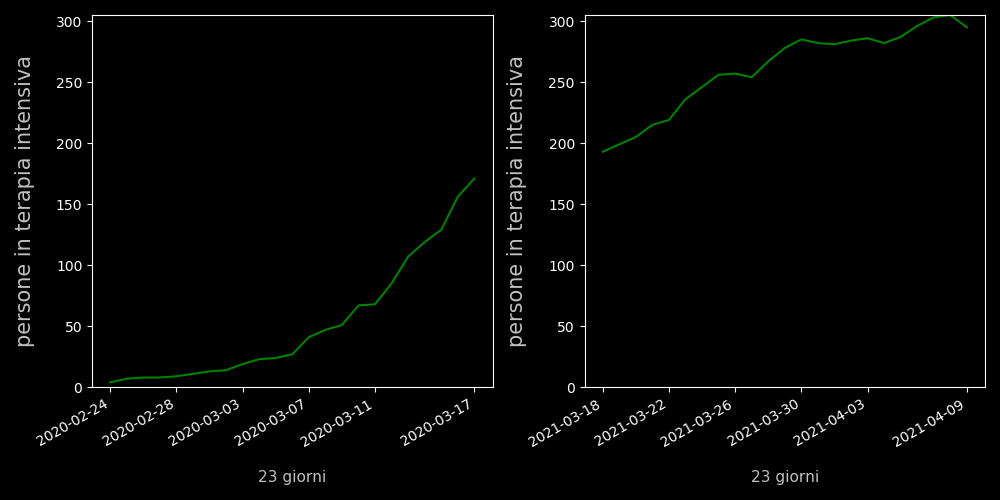

Confronto tra i giorni precedenti al lockdown e oggi dei casi di TERAPIA INTENSIVA in P.A.Trento
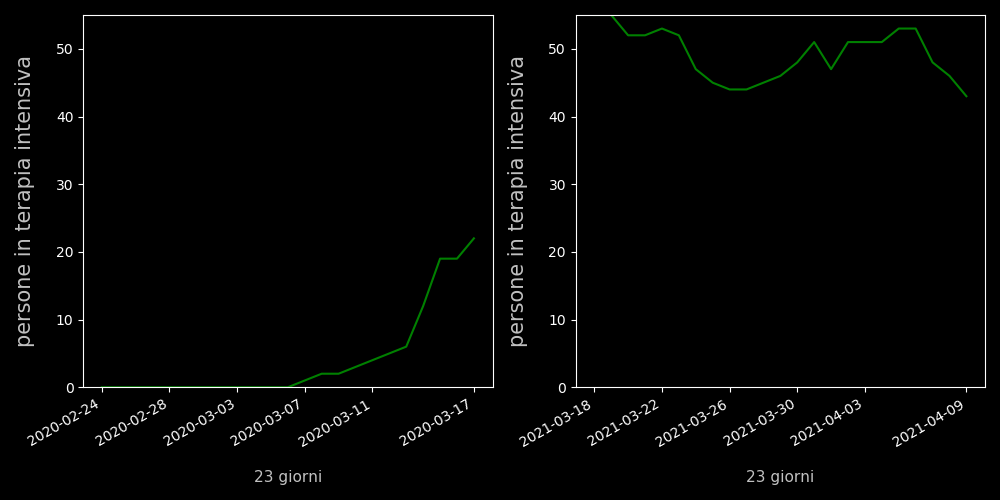

Confronto tra i giorni precedenti al lockdown e oggi dei casi di TERAPIA INTENSIVA in Lombardia
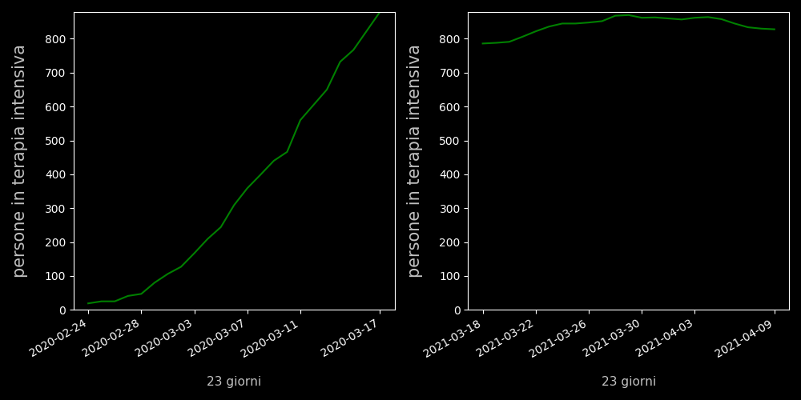

Confronto tra i giorni precedenti al lockdown e oggi dei nuovi casi positivi al tampone in Campania
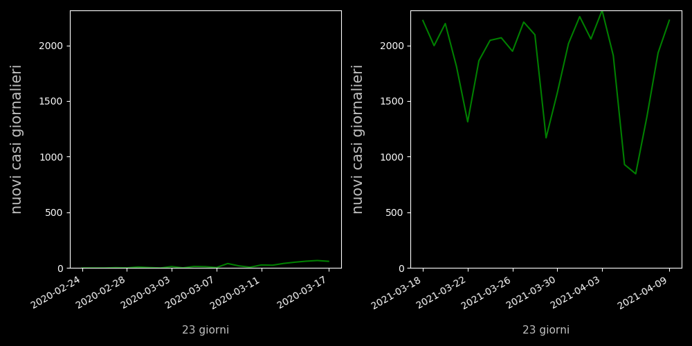

Confronto tra i giorni precedenti al lockdown e oggi dei casi di TERAPIA INTENSIVA in Campania
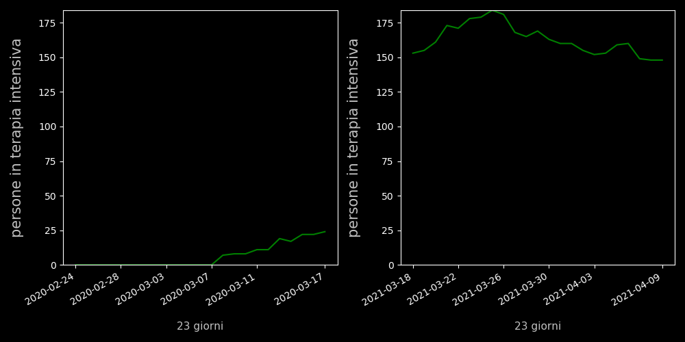